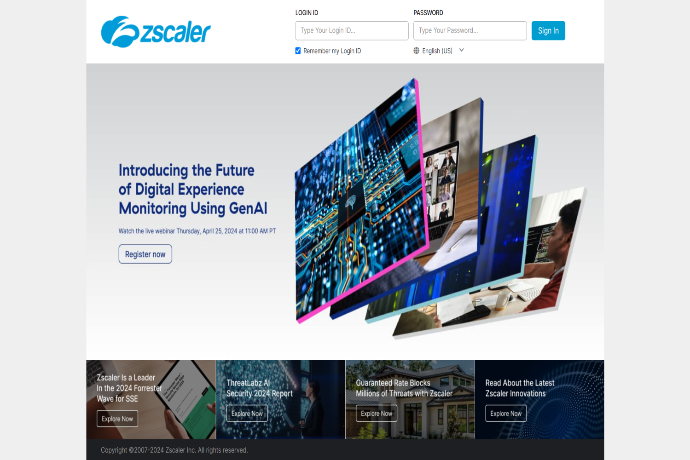
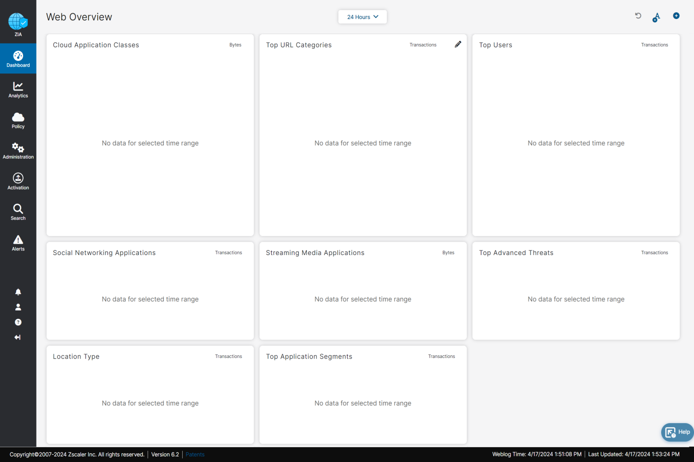
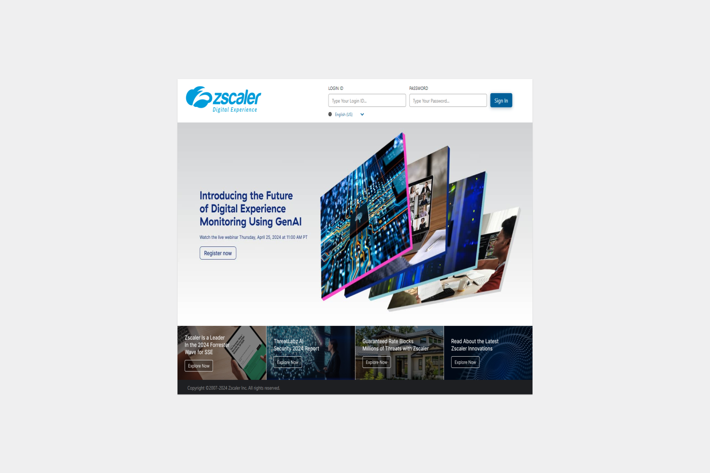
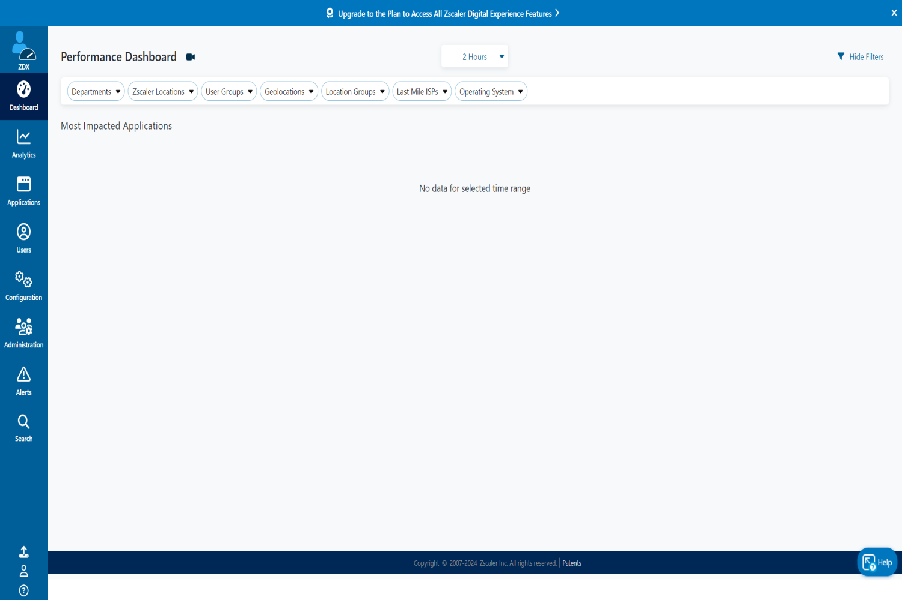
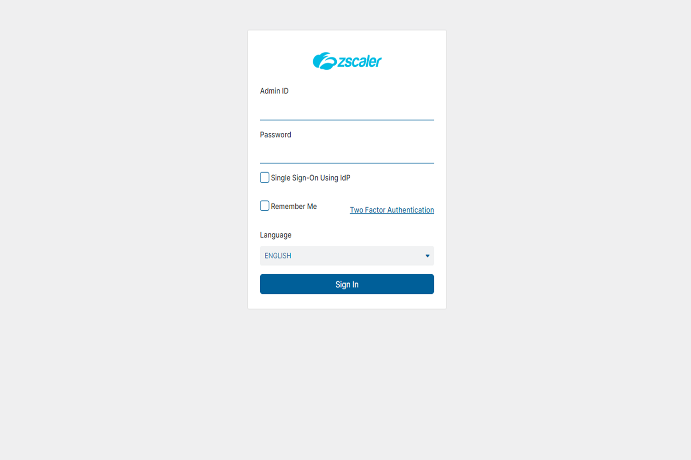
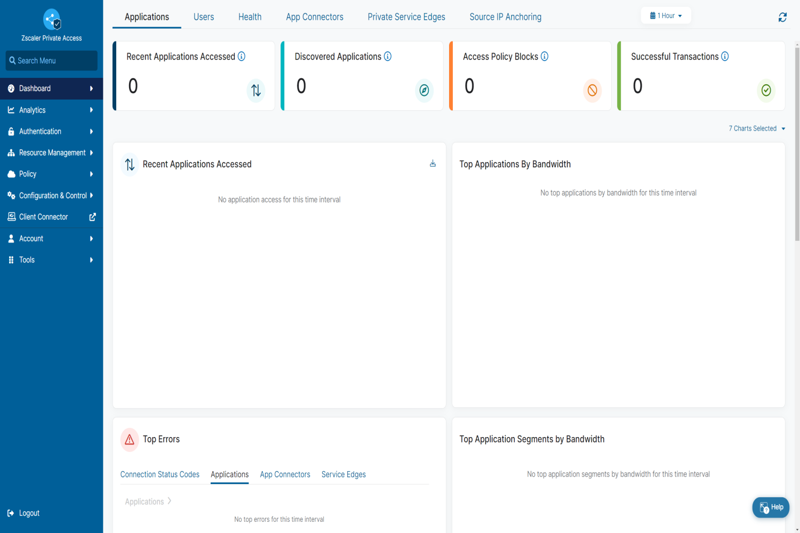
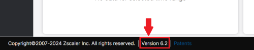

# What is SASE?
--------------
SASE stands for Secure Access Service Edge, which is essentially a modern approach to networking and security. It combines network connectivity with security features, all delivered as a cloud-based service

# SASE with Zscaler
--------------
For the Zscalar, The using **"Zscaler App Connector/Zscaler Client Connector"** to connect to **Edge service node of Zscaler** to using service such as Internet Access and private resource on premise.

Zscaler have 3 modules for provide SASE service.
### 1. ZIA:Zscaler Internet Access™

The ZIA module enables clients to access the internet through Zscaler's edge nodes, enforcing policies such as URL filtering, threat prevention, DNS security, and more.

### 2. ZDX:Zscaler Digital Experience™

The ZDX module provides insights and analytics into network performance, application usage, and user experience, allowing organizations to identify and resolve issues quickly. By monitoring and analyzing data from various sources, including the Zscaler cloud and user devices, ZDX helps businesses improve the performance and reliability of their digital services, ultimately enhancing productivity and satisfaction for end-users

### 3. ZPA:Zscaler Private Access™

The ZPA module enables the connection of private on-premises services with the Zscaler cloud. It utilizes the 'App Connector' to allow clients to access on-premises services securely when connected to the SASE environment.
   
- Steps for ZPA-Implement: [ZPA-Implement](https://github.com/mibukyochiro/ZPA-Implement).

# How to access management of Zscaler
--------------
To access the management of Zscaler, as it is a SASE service platform, you can configure or check your tenant by following the link and logging in.

- ZIA Login URL: https://admin.zscalerthree.net
    ***Note: URL depend on customer tenant.***

      

        
      

      

        
      

- ZDX Login URL: https://admin.zdxcloud.net
    ***Note: URL depend on customer tenant.***

      

        
      

      

        
      

- ZPA POC Login URL: https://admin.private.zscaler.com
- ***Note: URL depend on customer tenant.***

      

        
      

      

        
      

- ***Note: GUI may change depending on the version of Zscaler Cloud Management.*** You can check the version at the bottom left corner of the cloud management page.

